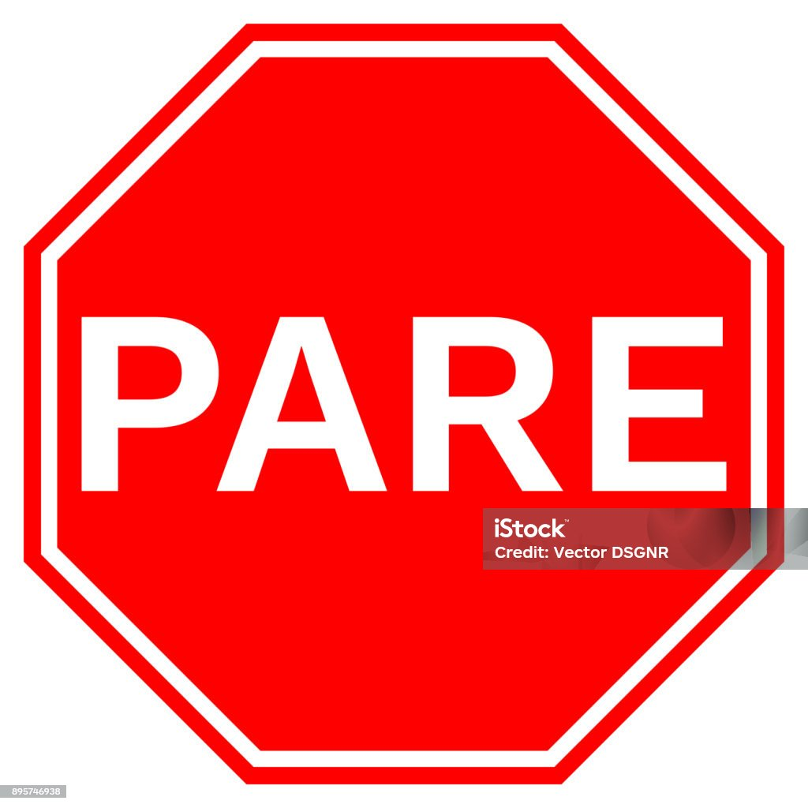
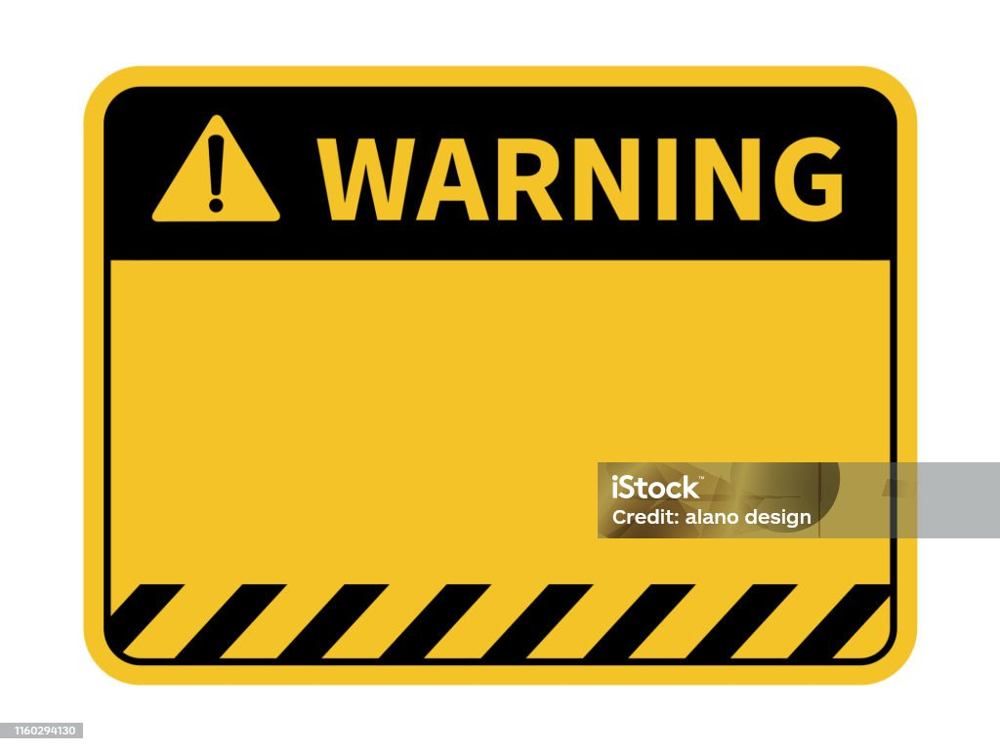

Image Text Analyzer

This project was developed as part of the DIO bootcamp to showcase skills in Git/GitHub, project organization, and basic AI concepts applied to text extraction from images.

## Project Structure
- **`inputs/`**: Contains the input images:
  - `stop.jpg`: A "STOP" sign.
  - `warning.jpg`: A "WARNING" sign.
- **`output/`**: Contains the text recognition results:
  - `stop_resultado.txt`: Text extracted from the "STOP" sign.
  - `warning_resultado.txt`: Text extracted from the "WARNING" sign.
- **`readme.md`**: Project documentation.

## How It Works
1. I added two images to the `inputs/` folder: a "STOP" sign and a "WARNING" sign.
2. I used OpenAI tool to extract text from the images.
3. The results were saved as `.txt` files in the `output/` folder.

## Examples
- **Image**: `inputs/stop.jpg`  
  - **Result**: `output/firstresult.txt` (contains "STOP")  
  

- **Image**: `inputs/warning.jpg`  
  - **Result**: `output/secondresult.txt` (contains "WARNING")  
  

## Insights
- Structuring folders like `inputs/` and `output/` makes the project workflow clear and intuitive.
- Including visual examples (images and results) enhances the portfolio's professionalism.
- Future possibilities: Integrate a real OCR API (e.g., Tesseract or Azure Vision) for automated text extraction.
